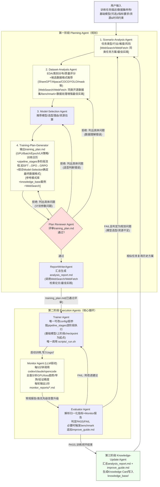

# 多智能体自动化训练框架架构设计

本计划旨在从零搭建一套按图片架构完整还原的三阶段多智能体训练编排框架：规划阶段（Scenario/Dataset/Model-Selection/TrainingPlan，汇总产出 `analysis_report.md` 深度分析报告）→ 执行阶段（Trainer/Monitor/Evaluator 核心循环，持续追加 `improve_guide.md` 迭代优化报告）→ 知识沉淀阶段（Knowledge-Update），Agent 推理引擎通过子进程封装 `codex`/`claude`/`opencode` CLI（三者均已在环境中确认可用，且均自带 WebSearch/WebFetch 等检索工具），训练引擎为占位适配层，支持 `llamafactory`/`verl`/`trl`/`transformers`/`ultralytics`（当前环境已装 trl/transformers/ultralytics/llamafactory/deepspeed，verl 未装）。

## 环境确认结果
- **Agent CLI 引擎**：`codex`(0.128.0)、`claude`(2.1.148)、`opencode`(1.14.40) 均已安装并在 PATH 中。
- **训练框架**：`trl`✅ `transformers`✅ `ultralytics`✅ `llamafactory`✅ `deepspeed`✅ 已安装；`verl`❌ 未安装（先做占位适配，接口预留，用户后续按需 `pip install verl`）。
- **GPU 资源**：8x NVIDIA A100-SXM4-40GB，当前全部空闲。
- **日志SDK**：`wandb`✅ `swanlab`✅ 已安装，Monitor Agent 可直接依赖其本地同步文件格式解析。
- **知识库**：本阶段用本地 JSON/Markdown 结构化存储 + 关键词/任务类型检索，不引入向量数据库，接口预留后续替换为 Chroma/FAISS 等 RAG 方案。
- **检索工具**：`codex exec` 支持 `--sandbox`（read-only/workspace-write/danger-full-access）与 `-c` 配置覆盖；`claude` 支持 `--tools` 指定内置工具集（如 `WebSearch,WebFetch`）。框架层不单独封装搜索 API，而是在调用这些 CLI 时通过参数启用内置 WebSearch/WebFetch 工具，由 CLI Agent 自主检索论文/网页/做 deep research，Python 层仅在 prompt 中明确要求“必须检索最新资料”。

## 多智能体编排流程图

- **Monitor 提前干预**：`Monitor Agent` 若在某轮 LLM 分析中判定存在严重问题（如明显早熟、loss 发散、GPU 显存持续异常），可将该轮报告标记为**高优先级告警**并直接触发 `Evaluator Agent` 提前介入判定，无需等待训练完成或到达下一个 checkpoint。
- **Plan Reviewer 分层回退**：`Plan Reviewer Agent` 评审 `training_plan.md` 后，若判定不满足要求（资源不合理/超参不当/pipeline_stages 设计缺陷/未达用户指标可行性等），**拒绝并列出具体问题清单**，按问题根源分层回退：仅计划参数问题 → 回退 `Training-Plan-Generator` 重新生成；选型判断错误 → 回退 `Model-Selection Agent`；数据理解错误 → 回退 `Dataset-Analysis Agent`；通过后才允许进入 Execution 阶段。
- **回退路径**：Evaluator 判定 `FAIL` 时优先回退给 `Trainer` 重训（超参级修复）；若连续失败或诊断为规划层问题（模型/资源选型错误），回退到 `Planning Agent`（Scenario-Analysis）重新规划，重新走完整第一阶段。
- **闭环复用**：`Knowledge-Update Agent` 写入的 Knowledge Card 会在下一次新任务的 `Scenario-Analysis`/`Model-Selection` 阶段被检索复用，形成持续优化闭环。

## 目录结构（新建）
```
uautoresearchX/
├── configs/
│   ├── agents.yaml            # 各Agent使用的CLI引擎、模型、超时等配置
│   ├── training_engines.yaml  # 训练引擎清单与run.sh映射
│   ├── training_pipeline_patterns.yaml  # 训练流程模式库（LLM-SFT/LLM-SFT-DPO/LLM-SFT-DPO-GRPO/CV-Finetune-EMA等，供Training-Plan-Generator参考）
│   └── data_format_patterns.yaml  # 数据格式规范库（ShareGPT/Alpaca/OpenAI messages/COCO/YOLO/VOC/COCO-seg/mask字段定义，供Dataset-Analysis与Training-Plan-Generator参考）
├── agents/
│   ├── base_agent.py           # BaseAgent抽象：构造prompt、调用engine、解析输出
│   ├── engines/
│   │   ├── base_engine.py      # BaseAgentEngine接口（run(prompt, tools)->text）
│   │   ├── codex_engine.py     # subprocess封装 codex CLI
│   │   ├── claude_engine.py    # subprocess封装 claude CLI
│   │   └── opencode_engine.py  # subprocess封装 opencode CLI
│   ├── planning/
│   │   ├── scenario_analysis_agent.py
│   │   ├── dataset_analysis_agent.py
│   │   ├── model_selection_agent.py
│   │   ├── training_plan_generator.py
│   │   ├── plan_reviewer_agent.py      # 评审training_plan.md，拒绝时列出问题清单并分层回退
│   │   └── report_writer_agent.py      # 汇总生成analysis_report.md
│   ├── data_format_converters/
│   │   ├── base_converter.py        # DataFormatConverter接口：convert(src_path, mapping_rules)->转换后数据路径
│   │   ├── sharegpt_converter.py    # 目标格式：ShareGPT JSON
│   │   ├── alpaca_converter.py      # 目标格式：Alpaca JSON
│   │   ├── coco_converter.py        # 目标格式：COCO检测/COCO-seg分割
│   │   ├── yolo_converter.py        # 目标格式：YOLO txt
│   │   └── mask_converter.py        # 目标格式：分割PNG mask
│   ├── execution/
│   │   ├── trainer_agent.py    # 唯一可改config/超参、唯一调用scripts/<engine>_run.sh
│   │   ├── monitor_agent.py    # LLM驱动，每5分钟调用CLI引擎全面分析并输出1份monitor_reports/*.md
│   │   ├── evaluator_agent.py  # 解析归一化指标+Monitor报告，判定crash/PASS/FAIL，触发benchmark
│   │   └── log_adapters/
│   │       ├── base_log_adapter.py    # LogAdapter接口：read_latest_metrics()->六字段dict
│   │       ├── local_log_adapter.py   # 解析logs/<run_id>/local/run.log纯文本
│   │       ├── wandb_log_adapter.py   # 解析logs/<run_id>/wandb/本地同步文件（wandb-summary.json/history）
│   │       └── swanlab_log_adapter.py # 解析logs/<run_id>/swanlab/本地同步文件（swanlog sqlite/json）
│   └── knowledge/
│       └── knowledge_update_agent.py  # 生成Knowledge Card，写入本地知识库
├── orchestrator/
│   ├── state_machine.py        # 三阶段+核心循环的状态机，处理FAIL回退到Planner
│   └── run_pipeline.py         # CLI入口：从用户输入到闭环执行
├── scripts/
│   ├── llamafactory_run.sh
│   ├── verl_run.sh
│   ├── trl_run.sh
│   ├── transformers_run.sh
│   └── ultralytics_run.sh
├── knowledge_base/
│   ├── cards/                  # 每次训练沉淀的 Knowledge Card (json)
│   └── index.json              # 关键词/任务类型 -> card路径 的简易索引
├── logs/<run_id>/               # 独立顶层日志目录（与runs/平行），支持三种日志形态
│   ├── wandb/                  # wandb本地同步文件（wandb-summary.json/events等）
│   ├── swanlab/                 # SwanLab本地同步文件（swanlog下的sqlite/json）
│   └── local/
│       └── run.log             # 训练引擎直接stdout重定向的本地日志（六字段格式）
├── runs/<run_id>/
│   ├── data/                     # Trainer Agent执行数据格式转换后的产物（根据training_plan.md的数据格式章节生成）
│   ├── config.yaml / deepspeed.json / lora.yaml / accelerate.yaml
│   ├── monitor.log / metrics.csv  # Monitor Agent归一化输出（无论源日志是wandb/swanlab/本地log，统一格式）
│   ├── monitor_reports/
│   │   └── report_<timestamp_or_seq>.md  # Monitor Agent每一轮LLM分析产出的全面分析报告（GPU/loss趋势/早熟/验证精度，高优先级告警单独标记）
│   ├── checkpoints/ / outputs/
│   ├── training_plan.md        # 规划阶段训练计划（结构化Markdown，Trainer解析执行）
│   ├── plan_review_log.md      # Plan Reviewer历次评审记录（拒绝原因/问题清单/通过版本号）
│   ├── analysis_report.md      # 规划阶段汇总分析报告（人类可读，深度分析）
│   └── improve_guide.md        # 执行阶段持续迭代优化报告（逐轮追加）
└── docs/
    └── ARCHITECTURE.md         # 架构说明与数据契约文档
```

## 阶段一：Planning Agent（规划）
- **输入契约**：训练任务描述、数据集路径/样例、基础模型（可选）、指标要求（如 mAP≥85%）、时间/资源约束（如 8 小时、GPU 数）。
- **Scenario-Analysis Agent**：产出任务类型、应用行业、难度评估、推理速度约束、优先级建议、潜在风险提示（结构化 JSON）。**必须调用 WebSearch/WebFetch** 检索同行业/同类任务的解决方案、论文、最佳实践，补充场景理解，输出中标注引用来源。
- **Dataset-Analysis Agent**：统计样本数、图像/文本规格、类别数、类别分布、质量评分、数据增强建议（结构化 JSON，若数据集不可访问则基于样例/描述估算并标注置信度）。**必须调用 WebSearch/WebFetch** 检索：(1) 同类开源数据集/已有 benchmark 指标，用于对比用户数据集特征与行业平均水平；(2) 该任务类型适用的数据处理/标注规范/数据增强最佳实践，用于支撑增强建议，输出中标注引用来源。
  - **数据格式候选推荐（新增）**：仅基于任务类型提出候选目标格式（尚未知模型选型，最终格式由 Training-Plan-Generator 结合 Model-Selection 确定）：**LLM 任务** → ShareGPT / Alpaca / OpenAI messages 格式；**CV 检测** → COCO / YOLO txt / VOC XML；**CV 分割** → COCO-seg多边形 / PNG mask。输出候选列表 + 当前数据集字段与候选格式的初步字段映射建议，可参考 `configs/data_format_patterns.yaml` 中的格式规范定义。
- **Model-Selection Agent**：基于前两者输出，给出推荐模型/备选模型、选型理由、GPU 需求估算、预计 mAP/指标、训练时长估算，并输出**模型对输入数据格式的硬性要求**（如某LLM需chat template/系统提示词字段，某CV框架需ultralytics YOLO txt格式），供 Training-Plan-Generator 结合 Dataset-Analysis 候选格式定案。
- **Training-Plan-Generator**：汇总前三者输出，产出完整 `training_plan.md`（结构化 Markdown，格式见下），包含：训练引擎选择、GPU/CPU/存储资源规划、Batch Size、Epoch、学习率策略（如 Cosine + Warmup）、优化器、精度（bf16等）、分阶段训练日历（Warmup/主导训练/Fine-tune/EMA+Eval，参照图中示例分段）。
  - **训练流程策略（新增）**：需明确回答"起点（基础模型 vs 中间 checkpoint）+ 阶段序列"，覆盖 LLM/VLM 类（如 Pretrain→SFT、SFT→DPO、SFT→DPO→GRPO、SFT→PPO 等组合）与 CV 类（预训练权重→微调→EMA 等）任务，按任务类型自适配：
    - **静态模式库参考**：`configs/training_pipeline_patterns.yaml` 预内置常见命名模式（如 `LLM-SFT`、`LLM-SFT-DPO`、`LLM-SFT-DPO-GRPO`、`CV-Finetune-EMA` 等），作为候选参考基线，不强制约束最终结果。
    - **决策依据来源**：(1) 优先检索 `knowledge_base/` 中是否有相似任务的历史成功案例可直接复用其训练流程；(2) 若无合适案例，调用 WebSearch/WebFetch 检索行业实践/论文补充依据；(3) 由 Training-Plan-Generator 的 LLM 综合任务类型、模式库、检索结果、历史案例，自主选择/裁剪/扩展出最终阶段序列，不局限于模式库中已有条目。
    - **产出要求**：`training_plan.md` 中需包含 `pipeline_stages` 章节（阶段列表，每阶段标注：起点权重来源、训练目标、所用训练引擎、关键超参、预计耗时），文中需附上决策依据说明与引用来源（历史案例ID 或 检索URL/论文标题）。
  - **数据格式定案（新增）**：结合 Dataset-Analysis 的候选格式列表与 Model-Selection 的模型硬性格式要求，确定唯一最终目标格式（若两者冲突，以 Model-Selection 的硬性要求为准），产出完整字段映射规则（原始字段 → 目标格式字段），写入 `training_plan.md` 的 `数据格式` 章节，供 Trainer Agent 调用 `data_format_converters/` 执行实际转换。
  - **`training_plan.md` 结构**（参考用户提供的工作计划模板风格，适配训练领域字段，Trainer Agent 按章节解析执行）：
    ```markdown
    # <任务名> - 训练计划

    ## TL;DR（人类速览）
    **训练目标**: <一句话概括任务与目标指标>
    **采用方案**: <基础模型/checkpoint起点 + pipeline_stages摘要，如 Qwen2.5-VL-7B, SFT→DPO>
    **资源与耗时**: <GPU数量/型号, 预计总耗时>
    **风险**: <Low|Medium|High> - <一句话原因>
    **关键决策依据**: <引用的历史案例/检索来源摘要>

    ## 资源规划
    | 项目 | 配置 |
    | --- | --- |
    | GPU | 8x A100-40GB |
    | Batch Size | ... |
    | 精度 | bf16 |
    | 训练引擎 | llamafactory/trl/... |

    ## Pipeline Stages（训练流程）
    | 阶段 | 起点权重 | 训练目标 | 引擎 | 关键超参 | 预计耗时 |
    | --- | --- | --- | --- | --- | --- |
    | 1. SFT | 基础模型 | ... | trl | lr=2e-5, epoch=3 | 4h |
    | 2. DPO | Stage1 checkpoint | ... | trl | beta=0.1 | 2h |

    ## 数据格式
    **目标格式**: <如 ShareGPT / COCO-seg / YOLO txt>
    **选择理由**: <来自Model-Selection的硬性要求或Dataset-Analysis候选推荐依据>
    | 原始字段 | 目标字段 | 转换规则 |
    | --- | --- | --- |
    | ... | ... | ... |

    ## 训练日历（分阶段）
    - 0~10 Epoch: Warmup ...
    - ...

    ## 验证与达标标准
    - 目标指标: <用户指标要求>
    - 评测方式: <benchmark清单/评测脚本>

    ## 决策依据与引用来源
    - <历史案例ID / 检索URL / 论文标题>
    ```
    该结构同时兼具人类可读性与机器可解析性：Trainer Agent 解析 `资源规划` 与 `Pipeline Stages` 表格获取结构化字段；`plan_reviewer_agent.py` 与 `report_writer_agent.py` 复用同一份文件生成评审与汇总报告。
- **Plan Reviewer Agent（新增，规划闭环质检）**：在 `Training-Plan-Generator` 产出 `training_plan.md` 后立即评审，检查资源可行性（GPU/显存是否足够）、超参合理性、`pipeline_stages` 设计是否匹配任务类型、**数据格式是否满足模型硬性要求且字段映射完整**、是否有依据支撑（历史案例/检索引用）、能否达成用户目标指标的可行性。
  - **判定不通过时**：拒绝并在 `plan_review_log.md` 中列出具体问题清单（逐条编号，标注问题类别：计划参数/选型判断/数据理解），按问题根源分层回退：仅计划参数问题（资源/超参/流程编排不当）→ 回退 `Training-Plan-Generator` 重新生成；根源于模型选型判断错误 → 回退 `Model-Selection Agent`；根源于数据集理解错误 → 回退 `Dataset-Analysis Agent`。被回退的 Agent 需针对问题清单逐条修正后重新产出，Plan Reviewer 再次评审，直至通过或达到最大重试次数后升级人工介入。
  - **判定通过时**：在 `plan_review_log.md` 记录通过版本号，`training_plan.md` 进入只读状态，交由 `ReportWriterAgent` 汇总 `analysis_report.md`，并允许进入 Execution 阶段。
- 每个 Agent 均为 `BaseAgent` 子类，通过对应 CLI 引擎（可在 `configs/agents.yaml` 中为不同 Agent 指定不同引擎，例如 Scenario 用 claude，Model-Selection 用 codex）生成结构化 JSON，用 pydantic schema 校验。
- **`analysis_report.md`（汇总报告，非四份独立文件）**：由 `Training-Plan-Generator`（或新增的轻量 `ReportWriterAgent`）在四个 Planning Agent 全部产出结构化 JSON 后，汇总为一份分章节 Markdown 报告，包含：
  - 第一章 场景需求深度分析（对应 Scenario-Analysis，含检索到的行业/同类任务最佳实践引用）
  - 第二章 数据集 EDA 分析（对应 Dataset-Analysis，类别分布、质量问题、增强策略依据）
  - 第三章 模型选型依据（对应 Model-Selection，含检索到的相关论文/benchmark对比、选型理由引用来源）
  - 第四章 训练计划总览（对应 Training-Plan-Generator，资源/日历/超参一览）
  - 各章节要求 Agent 在生成过程中调用其 CLI 内置的 WebSearch/WebFetch/论文检索能力，报告中需附引用来源（URL/论文标题）。

## 阶段二：Execution Agents（核心循环）
- **Trainer Agent**（唯一写权限）：
  - 依据已通过评审的 `training_plan.md`（解析其 `资源规划` 与 `Pipeline Stages` 表格）生成/修改 `runs/<run_id>/config.yaml`、`deepspeed.json`、`lora.yaml`、`accelerate.yaml`。
  - **按 `pipeline_stages` 顺序逐阶段执行**：每阶段依据其"起点权重来源"（基础模型或上一阶段产出的 checkpoint）配置初始权重路径，依次调用对应阶段的 `scripts/<engine>_run.sh`（子进程启动，后台运行，不同阶段可复用同一 `run_id` 下的子目录区分，如 `runs/<run_id>/stage_1_sft/`、`runs/<run_id>/stage_2_dpo/`）。
  - **根据 `training_engines.yaml` 中引擎对应的 `logger` 字段**（`local`/`wandb`/`swanlab`）启动训练并传入相应环境变量/参数（如 `WANDB_DIR=logs/<run_id>/wandb`、SwanLab 的 `logdir` 参数，本地模式则将 stdout 重定向至 `logs/<run_id>/local/run.log`），确保三种日志形态均写入 `logs/<run_id>/` 对应子目录。
  - 唯一负责调用 `scripts/<engine>_run.sh`。
  - **数据格式转换（新增，在启动训练前执行）**：解析 `training_plan.md` 的 `数据格式` 章节（目标格式/字段映射规则），调用 `data_format_converters/` 对应转换器将原始数据集转换为目标格式（如 ShareGPT/Alpaca JSON、COCO/YOLO标注、分割mask），输出到 `runs/<run_id>/data/`，转换失败则中断并上报 Evaluator/回退 Plan Reviewer。
  - 若 Evaluator 判定 FAIL 且给出改进建议，Trainer 负责修改超参并重启当前阶段训练（记录版本号），或按建议调整后续阶段配置。
- **Monitor Agent（LLM 驱动，只读，不可修改配置）**：
  - **单一 LLM 循环**：每 `interval_minutes`（默认 5 分钟，见 `configs/agents.yaml`）通过 `log_adapters/`（`local`/`wandb`/`swanlab`）从 `logs/<run_id>/` 读取最新原始指标（无需API Key）+ `nvidia-smi` GPU 状态，先归一化写入 `runs/<run_id>/monitor.log`/`metrics.csv`（结构化基础字段，供 Evaluator/后续轮次趋势对比使用），再将归一化数据+历史趋势喂给 CLI 引擎（`codex`/`claude`/`opencode`，通过 `configs/agents.yaml` 的 `monitor.engine` 指定）做全面分析。
  - **分析维度**：(1) **GPU 运行情况**（利用率/显存/是否有异常波动）；(2) **Loss 下降趋势**（是否平稳下降/停滞/发散）；(3) **早熟/过拟合迹象**（train/val loss 差距扩大、验证指标不再提升但训练loss仍下降等）；(4) **验证精度**（周期性验证指标与目标差距、变化趋势）；(5) 其他可观测异常（速度骤降、存储/磅盈告警等）。
  - **产出**：每轮固定输出 **1 份** `runs/<run_id>/monitor_reports/report_<seq>.md`，包含：本轮时间/epoch范围、各维度观察结论、风险等级（Normal/Warning/Critical）、建议措施。若判定为 **Critical**（如明显早熟、loss 发散、GPU 显存持续异常），额外标记为高优先级告警并直接触发 `Evaluator Agent` 提前介入判定，不等待训练完成或下一个 checkpoint。
- **Evaluator Agent**（评测与判定）：
  - 解析 Monitor Agent 归一化后的 `metrics.csv`/`monitor.log` 六字段（epoch/loss/metric/speed/memory/checkpoint）及最新 `monitor_reports/*.md` 分析报告作为辅助判断依据，不直接依赖原始日志来源。
  - 若 Monitor 报 Crash → 直接判定失败并上报详情。
  - 否则在训练完成或阶段性 checkpoint 时，按需触发 benchmark（MMLU/GSM8K/MathBench/LiveCodeBench 或自定义 benchmark，依任务类型选择）。
  - 输出 PASS（达到用户指标）或 FAIL（附差距分析与改进建议），FAIL 时把建议写回，触发回退：优先 Trainer 调整超参重训；若判断为规划问题（模型选型/资源不足），回退到 Planning Agent 重新规划。
- 三者共享 `logs/<run_id>/`（wandb/swanlab/local 三种原始日志）与 `runs/<run_id>/`（monitor.log/metrics.csv/monitor_reports/checkpoints/outputs）只读产物区，通过文件系统解耦，不直接互相调用，由 `orchestrator/state_machine.py` 驱动轮转。
- **`improve_guide.md`（持续迭代优化报告）**：由 Evaluator Agent 维护，**每一轮**评测（无论 PASS 或 FAIL）都向文件追加一节迭代记录，包含：本轮迭代编号/时间、Trainer 使用的超参快照、本轮指标结果、与目标差距分析、下一轮改进建议（超参/数据/模型层面）、若判定 FAIL 是否需要检索论文/最佳实践支撑改进建议（同样使用 CLI 内置 WebSearch 工具）。该文件形成完整迭代时间线，训练闭环结束后作为 Knowledge-Update Agent 的核心输入之一。

## 阶段三：Knowledge-Update Agent（经验沉淀）
- 训练闭环结束（PASS或多轮FAIL后终止）后触发。
- 汇总：任务描述与数据集特征、评估策略与结果、模型选型理由与效果、最佳超参与结论、遇到的问题与解决方案（长尾问题处理/夜间增强策略等）。
- 生成结构化 Knowledge Card（JSON），字段参考图示：任务描述摘要/数据统计/模型与超参/mAP结果/经验总结，并整合 `training_plan.md`、`analysis_report.md`、`improve_guide.md`、关键 `monitor_reports/*.md`（尤其是 Critical 告警轮次）全文作为长文本上下文来源提炼要点（包含最终采用的 pipeline_stages 流程以便后续相似任务直接复用）。
- 写入 `knowledge_base/cards/<card_id>.json`，并更新 `knowledge_base/index.json`（关键词、任务类型 → card路径），供未来 Scenario/Model-Selection Agent 检索复用（相似任务快速复用历史成功方案）。

## Agent 引擎适配层
- `BaseAgentEngine.run(system_prompt, user_prompt, output_schema=None, timeout=...) -> str`
- 各子类通过 `subprocess.run`/`Popen` 调用对应 CLI（非交互模式，如 `codex exec`, `claude -p`, `opencode run`），捕获 stdout，若指定 `output_schema` 用 pydantic 校验+重试。
- `configs/agents.yaml` 示例：
```yaml
scenario_analysis: {engine: claude, model: default, timeout: 120}
dataset_analysis:   {engine: codex, model: default, timeout: 120}
model_selection:    {engine: claude, model: default, timeout: 120}
training_plan:      {engine: opencode, model: default, timeout: 180}
plan_reviewer:      {engine: claude, model: default, timeout: 120}
report_writer:      {engine: claude, model: default, timeout: 120}
trainer:            {engine: codex, model: default, timeout: 60}
monitor:            {engine: claude, model: default, timeout: 180, interval_minutes: 5}  # 每5分钟调用LLM全面分析，可配置为codex/claude/opencode
evaluator:          {engine: claude, model: default, timeout: 120}
knowledge_update:   {engine: claude, model: default, timeout: 120}
```
（`monitor` 为单一LLM循环，无规则预检环节，每轮轮询均直接调用LLM，`interval_minutes` 控制轮询间隔以平衡LLM调用成本/延时）

## 训练引擎适配层
- `scripts/<engine>_run.sh` 统一接口：`bash scripts/<engine>_run.sh <run_dir> <config_path> <log_dir> <logger_type>`，内部按各框架 CLI 组装命令（llamafactory: `llamafactory-cli train`；trl: `trl sft`/`trl dpo`；transformers: `Trainer` 驱动脚本；ultralytics: `yolo train`；verl: 占位 TODO，未安装先输出安装提示），并按 `<logger_type>` 将指标写入对应 `logs/<run_id>/{local|wandb|swanlab}/`。
- 三种日志形态：
  - **local**：脚本 stdout 按六字段格式重定向到 `logs/<run_id>/local/run.log`（字段：`epoch, loss, metric, speed(samples/s), memory(GPU GB), checkpoint_path`）。
  - **wandb**：设置 `WANDB_MODE=offline`（或默认）与 `WANDB_DIR=logs/<run_id>/wandb`，训练引擎自身写入本地同步文件，Monitor 通过 `wandb_log_adapter.py` 解析。
  - **swanlab**：设置 SwanLab 的 `logdir=logs/<run_id>/swanlab`，训练引擎自身写入本地文件，Monitor 通过 `swanlab_log_adapter.py` 解析。
- `configs/training_engines.yaml` 需为每个引擎/每次运行指定 `logger: local|wandb|swanlab`（示例：`llamafactory: {logger: wandb}`、`ultralytics: {logger: local}`），由 Trainer Agent 读取并透传给 `run.sh`。

## 状态机与闭环
`orchestrator/state_machine.py` 状态：`PLANNING → PLAN_REVIEW → (拒绝→回退P4/P3/P2重新规划) | (通过→REPORT→TRAINING) → MONITORING(并行) → EVALUATING → (PASS→KNOWLEDGE_UPDATE→DONE) | (FAIL→回退TRAINER重试 或 回退PLANNING重规划，超过最大重试次数则终止并沉淀失败经验)`。

## 交付步骤（实现顺序）
1. 目录骨架 + `configs/agents.yaml` + `configs/training_engines.yaml` + `configs/training_pipeline_patterns.yaml` + `configs/data_format_patterns.yaml`。
2. `agents/engines/*`：三个CLI引擎适配 + 单元测试（mock subprocess）。
3. `agents/base_agent.py` 与 pydantic 输出 schema。
4. Planning 六个 Agent（含 Plan Reviewer/ReportWriter）+ 集成测试（用示例输入跑通 `training_plan.md` 并通过评审）。
5. `scripts/<engine>_run.sh` 占位脚本（llamafactory/trl/transformers/ultralytics 可运行最简训练命令，verl 输出未安装提示）。
6. Execution 三个 Agent（Trainer/Monitor/Evaluator）+ 文件系统数据契约（其中 Monitor 初步只实现归一化指标采集，未接LLM）。
7. `orchestrator/state_machine.py` 串联闭环，支持 FAIL 回退。
8. Knowledge-Update Agent + `knowledge_base/` 简易检索。
9. `orchestrator/run_pipeline.py` CLI 入口 + `docs/ARCHITECTURE.md`。
10. 端到端 demo：用一个小型示例任务跑通全流程并验证 monitor/evaluator 日志格式。

## 交付步骤更新
11. `ReportWriterAgent`（或复用 Training-Plan-Generator）汇总生成 `analysis_report.md`，验证 WebSearch/WebFetch 工具在实际 CLI 调用中确实被触发（检查输出是否含引用来源）。
12. Evaluator Agent 增加 `improve_guide.md` 逐轮追加逻辑，验证 PASS/FAIL 两种路径均正确写入。
13. `plan_reviewer_agent.py` 实现评审逻辑与 `plan_review_log.md` 写入，构造故意存在缺陷的 `training_plan.md`（如资源不足/超参不合理）验证拒绝路径与分层回退（P4/P3/P2）是否正确触发；正常计划验证可顺利通过进入 Execution。
14. `log_adapters/`（local/wandb/swanlab）实现与单元测试：分别构造三种 `logs/<run_id>/` 示例数据（本地run.log、wandb-summary.json、swanlab同步文件），验证 Monitor Agent 均能正确解析并归一化输出到 `metrics.csv`。
15. `monitor_agent.py` 接入 LLM 循环：构造包含正常/早熟/loss发散/GPU异常多种场景的模拟指标序列，验证每轮能正确输出 `monitor_reports/*.md` 且 Critical 场景能正确触发 Evaluator 提前介入。
16. `data_format_converters/`（sharegpt/alpaca/coco/yolo/mask）实现与单元测试：构造小型LLM对话样例与CV标注样例，验证各转换器能正确根据 `training_plan.md` 的字段映射规则输出目标格式文件；Dataset-Analysis/Model-Selection/Training-Plan-Generator 三者数据格式协作集成测试（候选→定案→转换）。

## 待确认/风险点
- CLI 工具的非交互批处理模式与结构化输出稳定性需要实测（`codex exec` / `claude -p` / `opencode run` 参数以实际版本CLI帮助为准）。
- verl 未安装，若需要真实验证需用户后续 `pip install verl` 或提供源码路径。
- `codex exec` 默认 `--sandbox` 可能限制网络访问，若 WebSearch/WebFetch 实测不可用，需要用户确认放开网络权限（如 `-s workspace-write` 或额外网络白名单配置），届时再补充具体参数。
- 长时间训练场景下 `improve_guide.md` 可能持续增长，后续可考虑按迭代轮次分文件或摘要压缩，本阶段暂不处理。
- `training_plan.md` 的表格解析（Trainer/PlanReviewer/ReportWriter 均依赖同一份文件）需要用统一的 Markdown 表格解析工具（如 `markdown-it` + 表格插件或简单正则），需在实现阶段验证解析健壮性（尤其是超参值含逗号/多值单元格的情况）。
- Plan Reviewer 与 Planning Agent 之间的重试可能无限循环，需设置最大重试次数（建议 3 次），超过后终止并提示需人工介入调整任务描述/指标要求。
- 若用户任务涉及未预内置的特殊数据格式（非 ShareGPT/Alpaca/COCO/YOLO/mask 五种已列格式），Dataset-Analysis/Training-Plan-Generator 需能降级为通用 JSON 格式并标注需人工补充转换器，`data_format_converters/` 接口需预留扩展点以支持后续新格式插件式注册。
- wandb/SwanLab 本地同步文件的具体格式（文件名/内部结构）依赖其 SDK 版本，`wandb_log_adapter.py`/`swanlab_log_adapter.py` 需在实现阶段针对当前已安装版本实测确认文件路径与字段名，避免版本升级导致解析失效。
- Monitor Agent 改为每轮均调用 LLM（无规则预检），需评估 CLI 调用延时/成本是否在 5 分钟间隔内可接受；若单轮 LLM 分析耗时过长（超过 `interval_minutes`），需考虑轮次跳过或异步排队机制（本阶段暂不实现，先按顺序阻塞式执行）。
- 硬故障（CUDA OOM/进程崩溃）可能滞后最多一个 `interval_minutes` 周期（默认5分钟）才被 LLM 分析发现，用户已知悉并接受此权衡；若后续需要更快响应，可在不改变现有单循环设计的前提下额外引入独立快速规则安全网。

## CLI引擎桥接升级（STDIO Streaming / JSON-RPC）
将 `agents/engines/*` 中对 `codex`/`claude`/`opencode` 的简单 `subprocess.run` 一次性封装，升级为各CLI原生最强通信协议（codex 的 `app-server --stdio` JSON-RPC 2.0、claude 的 `stream-json` 双向NDJSON流、opencode 的 ACP/serve 能力）的长驻进程桥接层，通过统一的 `BaseAgentEngine` 接口对上层 Agent 屏蔽协议差异，所有 Agent（规划类+执行类）统一迁移到新桥接层。

### 调研结论（已通过WebSearch核实）
| CLI | 最强原生协议 | 关键特性 |
| --- | --- | --- |
| `codex` | `codex app-server --stdio` | 完整 JSON-RPC 2.0（隐藏`jsonrpc:"2.0"`头），需 `initialize`→`initialized`握手，`thread/start`→`turn/start`发起对话，服务端流式推送 `item/started`/`item/agentMessage/delta`/`item/completed`/`turn/completed` 通知，支持 `command/exec*` 系列方法执行/流式读取/终止子命令，`approvalPolicy`可设为`never`免交互审批 |
| `claude` | `claude -p --output-format stream-json --input-format stream-json --verbose --include-partial-messages` | NDJSON双向流：stdin写入`{"type":"user_message","content":...}`，stdout逐行JSON事件（`stream`/`delta`/`tool_use_start`/`result`等）；SDK MCP工具调用时会内嵌标准JSON-RPC 2.0请求（`sdk_control_request`/`mcp_message`），需按`permission-mode`配置规避交互式审批 |
| `opencode` | ACP (Agent Client Protocol) | 官方文档确认支持ACP，是编辑器/客户端通用的stdio JSON-RPC标准（与`claude --acp`/`codex acp`同族），具体子命令/参数需在实现阶段以当前安装版本CLI帮助信息验证（文档覆盖度不如前两者） |

**设计决策（已与用户确认）**：不强求三者收敛到统一底层协议（如全部走ACP），而是**各engine适配其原生最强协议，通过统一的 `BaseAgentEngine` 抽象接口封装差异**；且**所有Agent（Planning六个+Execution三个）统一切换到新桥接层**，即使一次性结构化输出场景也通过新协议获取（可选择不消费中间事件，等价于原有阻塞式调用）。

### 统一接口设计
```python
# agents/engines/base_engine.py
class AgentEvent:  # 统一事件模型，各engine内部协议差异在此层被归一化
    type: str        # "text_delta" | "tool_use_start" | "tool_use_end" | "exec_output" | "error" | "done"
    payload: dict
    raw: dict         # 原始协议消息，便于调试

class AgentResult:
    text: str                     # 拼接后的最终文本
    structured_output: dict | None
    usage: dict | None
    events: list[AgentEvent]      # 完整事件轨迹（用于日志/回放）

class BaseAgentEngine(ABC):
    def start(self) -> None: ...              # 拉起长驻子进程 + 协议握手（若协议需要）
    def run(self, system_prompt, user_prompt, output_schema=None,
            on_event: Callable[[AgentEvent], None] | None = None,
            timeout: float = ...) -> AgentResult: ...
    def cancel(self) -> None: ...              # 中途取消当前turn（仅JSON-RPC类协议支持）
    def stop(self) -> None: ...                # 优雅关闭：关闭stdin/发终止请求，超时后SIGTERM
```
- `run()` 对上层始终表现为阻塞调用（不传 `on_event` 等价于旧版 `subprocess.run` 语义），但内部通过流式协议读取，可选把中间事件转发给调用方（Monitor/Trainer 用于日志/实时展示，Planning类可忽略）。
- 若指定 `output_schema`，在拼接完整文本/收到 `result`/`turn/completed` 后用 pydantic 校验，失败则重试（保留现有重试语义）。

### 各Engine实现要点
- **`codex_engine.py`**：`subprocess.Popen(["codex", "app-server", "--stdio"], ...)`长驻；封装 `initialize`→`initialized`握手，每次`run()`发起`thread/start`（`approvalPolicy: {type: "never"}`, `sandbox`透传现有配置）→`turn/start`，读取通知流映射为`AgentEvent`，`turn/completed`时结束并汇总；`cancel()`调用中断方法（若协议提供，需实现阶段核实具体method名）。
- **`claude_engine.py`**：`subprocess.Popen(["claude", "-p", "--output-format", "stream-json", "--input-format", "stream-json", "--verbose", "--include-partial-messages", "--permission-mode", <配置的免审批模式>], ...)`；写入NDJSON `user_message`到stdin；逐行解析stdout：`stream`事件的`text_delta`映射为`AgentEvent`，`tool_use_start/end`同理，收到顶层`result`即结束该轮；若出现`sdk_control_request`（MCP工具回调）按文档协议应答，避免60秒超时。
- **`opencode_engine.py`**：优先尝试ACP子命令/参数（需实现阶段用 `opencode --help`/`opencode acp --help` 等实测确认，当前文档信息有限）；若ACP暂不可用或不稳定，降级为现有 `opencode run` 一次性subprocess封装并在日志中标注降级状态（保证功能不中断，风险见下）。
- **`jsonrpc_transport.py`**（新增，codex/opencode共用）：通用NDJSON stdio JSON-RPC读写工具——请求/响应按`id`匹配（维护`{id: Future}`表）、通知按`method`路由到回调、写入时补/剥`jsonrpc:"2.0"`字段以兼容codex的省略约定、支持独立读线程持续拉取stdout避免阻塞写入。
- **`process_manager.py`**（新增）：长驻子进程生命周期管理——启动、存活检测（定期心跳/管道健康检查）、优雅关闭（关stdin/发终止请求，超时SIGTERM→SIGKILL）、异常退出后的自动重启策略（对Planning类一次性调用可关闭重启；对Monitor长期运行的引擎需谨慎重启避免丢失上下文）。

### 目录结构变更（增量）
```
agents/engines/
├── base_engine.py        # 变更：BaseAgentEngine抽象升级为上述接口 + AgentEvent/AgentResult
├── jsonrpc_transport.py  # 新增：通用JSON-RPC 2.0 stdio帧读写/请求路由工具
├── process_manager.py    # 新增：长驻子进程生命周期管理
├── codex_engine.py       # 变更：改为 app-server --stdio JSON-RPC 客户端
├── claude_engine.py      # 变更：改为 stream-json 双向NDJSON客户端
└── opencode_engine.py    # 变更：优先ACP，不可用则降级为原subprocess封装
```

### 配置变更
`configs/agents.yaml` 每个Agent条目新增可选字段：
```yaml
scenario_analysis: {engine: claude, model: default, timeout: 120, permission_mode: bypassPermissions}
trainer:            {engine: codex, model: default, timeout: 60, sandbox: workspace-write}
monitor:            {engine: claude, model: default, timeout: 180, interval_minutes: 5, permission_mode: bypassPermissions}
```
- `permission_mode`/`sandbox`等透传给对应engine握手参数，替代原来仅用CLI flag拼接的方式。
- 新增全局开关（如 `engines.process_pool: per_call|warm`）控制引擎进程是每次`run()`临时拉起+关闭（默认，隔离性更好，与现状行为一致）还是维持常驻池复用（可选优化项，本阶段默认关闭）。

### 对上层Agent的影响
- `BaseAgent`（`agents/base_agent.py`）调用方式不变：仍是 `engine.run(system_prompt, user_prompt, output_schema=...)`，因此 Planning 六个 Agent、`plan_reviewer_agent.py`、`report_writer_agent.py`、`evaluator_agent.py`、`knowledge_update_agent.py` **无需修改调用代码**，仅底层协议升级。
- `monitor_agent.py`/`trainer_agent.py` 可选传入 `on_event` 回调，将中间事件（如Codex的`command/exec`输出流、Claude的分析文本delta）实时追加写入各自的日志文件（`monitor_reports/`执行过程日志、Trainer的训练启动过程日志），提升可观测性，但不改变最终产物契约（`monitor_reports/*.md`、`training_plan.md`等文件格式不变）。

### 交付步骤（独立编号，接续本升级自身序列）
17. `jsonrpc_transport.py` + `process_manager.py` 基础设施实现与单元测试（mock stdio管道，测试请求/响应匹配、通知路由、超时、优雅关闭）。
18. `codex_engine.py` 重写为 `app-server --stdio` 客户端：实测当前已安装 `codex`(0.128.0) 是否支持 `app-server --stdio`（文档显示v0.136+），若版本过低则记录降级方案（fallback到`codex exec --json`一次性NDJSON流，仍优于纯文本）。
19. `claude_engine.py` 重写为 `stream-json` 双向客户端：实测`--input-format stream-json`实际消息格式（官方文档不完整，参考已核实的第三方协议文档），验证`permission-mode`免审批配置生效。
20. `opencode_engine.py` 实测ACP支持情况（`opencode --help`/官方ACP文档 `opencode.ai/docs/acp/`），确定可用则实现JSON-RPC客户端，否则实现降级路径并记录已知限制。
21. `base_engine.py`/`AgentEvent`/`AgentResult` 统一接口 + 三个engine的集成测试（同一 `run()` 调用在三种engine下行为一致，`on_event`回调可选消费）。
22. Planning/Execution 全部现有Agent集成回归测试：验证迁移到新桥接层后功能不退化（`training_plan.md`/`analysis_report.md`/`monitor_reports/`等产物内容与迁移前等价）。

### 待确认/风险点（独立列表）
- 当前环境 `codex`(0.128.0) 是否已支持 `app-server --stdio`（该flag据资料在v0.136+才加入），需实现阶段用 `codex app-server --help` 实测确认，若不支持需降级为 `codex exec --json`（单向NDJSON事件流，非完整JSON-RPC）。
- `claude --input-format stream-json` 官方文档不完整（见 anthropics/claude-code#24594），需按第三方逆向文档（`claude-agent-sdk-go`/`claude-max-api-proxy`等）实测校验实际消息格式，存在协议细节随版本变化的风险。
- `opencode`(1.14.40) 的ACP具体调用方式（子命令/参数）文档覆盖不足，需实现阶段直接查CLI帮助确认；若不可用，`opencode_engine.py`降级为原一次性subprocess封装，三engine能力不对等需在文档中明确标注。
- 长驻子进程相比原一次性`subprocess.run`引入新的资源管理复杂度（僵尸进程、管道阻塞死锁风险），`process_manager.py`需覆盖异常退出/超时清理测试。
- Claude的`sdk_control_request`/MCP回调协议若需要处理（例如未来接入自定义工具），复杂度较高；当前阶段通过`permission_mode`免审批规避大部分交互，未来若需支持SDK级MCP工具再扩展。
- 三种协议的错误语义不同（JSON-RPC错误对象 vs NDJSON的`error`事件 vs 进程退出码），`AgentEvent(type="error")`需要设计统一的错误归一化字段，便于上层Agent一致处理重试逻辑。
